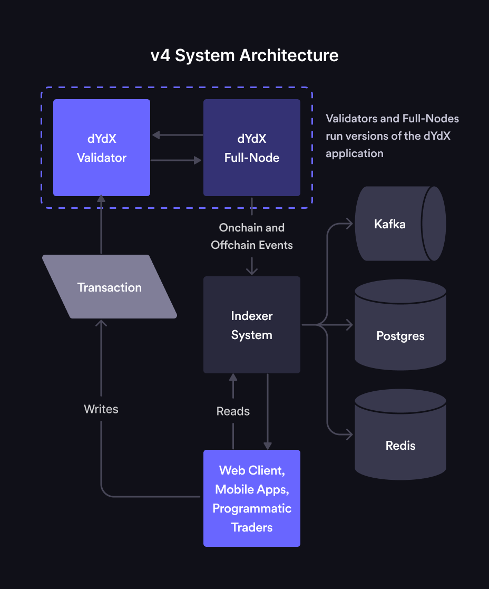

# Intro to dYdX v4 Architecture

v4 (or dYdX Chain) is the next iteration of the dYdX protocol, which will consist of open-source software.

# v4 System Architecture

dYdX v4 is being designed to be completely decentralized end-to-end. The main components broadly include the protocol, the Indexer, and the front end. Each of these components will be made available as open source software. 

* Validators: Validators are responsible for storing orders in an in-memory orderbook (i.e. off chain and not committed to consensus), gossipping transactions to other validators, and producing new blocks for the dYdX Chain through the consensus process. The consensus process will have validators take turns as the proposer of new blocks in a weighted-round-robin fashion (weighted by the number of tokens staked to their node). The proposer is responsible for proposing the contents of the next block. When an order gets matched, the proposer adds it to their proposed block and initiates a consensus round. If ⅔ or more of the validators (by stake weight) approve of a block, then the block is considered committed and added to the blockchain. Users will submit transactions directly to validators.

* Full Nodes: A Full Node represents a process running the v4 open-source application that does not participate in consensus. It is a node with 0 stake weight and it does not submit proposals or vote on them. However, full nodes are connected to the network of validators, participate in the gossiping of transactions, and also process each new committed block. Full nodes have a complete view of the dYdX Chain and its history, and are intended to support the Indexer. Some parties may decide (either for performance or cost reasons) to run their own full node and/or Indexer.

* Indexer: The Indexer is a read-only collection of services whose purpose is to index and serve blockchain data to end users in a more efficient and web2-friendly way. This is done by consuming real time data from a v4 full node, storing it in a database, and serving that data through a websocket and REST requests to end-users.
While the v4 open-source protocol itself is capable of exposing endpoints to service queries about some basic on-chain data, those queries tend to be slow as validators and full nodes are not optimized to efficiently handle them. Additionally, an excess of queries to a validator can impair its ability to participate in consensus. For this reason, many Cosmos validators tend to disable these APIs in production. This is why it is important to build and maintain Indexer and full-node software separate from validator software.
Indexers will use Postgres databases to store on-chain data, Redis for off-chain data, and Kafka for consuming and streaming on/off-chain data to the various Indexer services.

# Lifecycle of an Order

1. User places a trade on a decentralized front-end (e.g., website) or via API

2. The order is routed to a validator. That validator gossips that transaction to other validators and full nodes to update their orderbooks with the new order.

3. The consensus process picks one validator to be the proposer. The selected validator matches the order and adds it to its next proposed block.

4. The proposed block continues through the consensus process. 
If ⅔ of validator nodes vote to confirm the block, then the block is committed and saved to the on-chain databases of all validators and full nodes.
If the proposed block does not successfully hit the ⅔ threshold, then the block is rejected.

5. After the block is committed, the updated on-chain (and off-chain) data is streamed from full nodes to Indexers. The Indexer then makes this data available via API and Websockets back to the front end and/or any other outside services querying for this data.